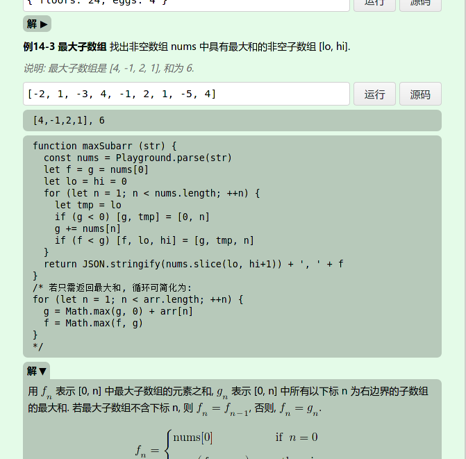
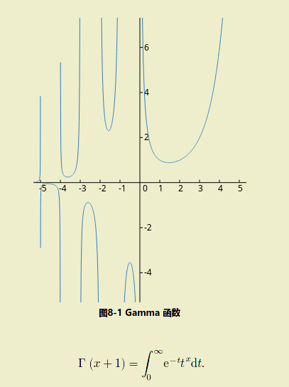
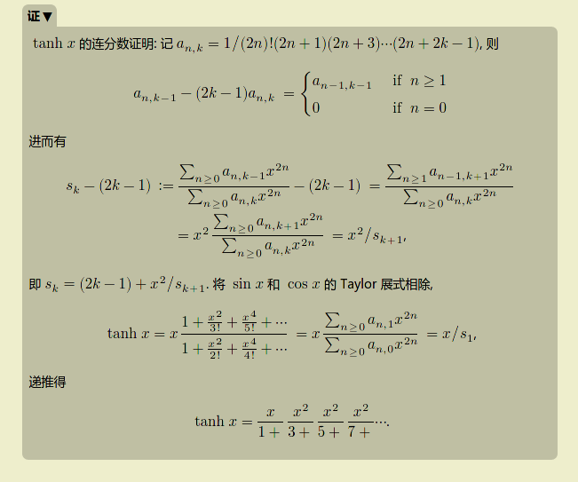
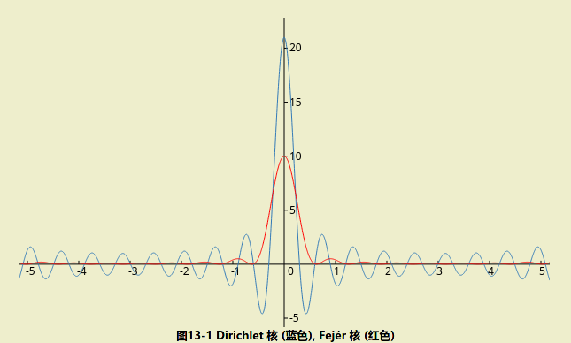
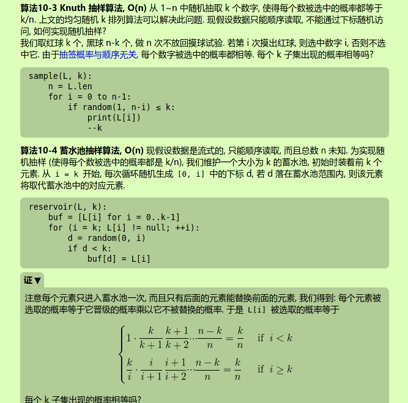
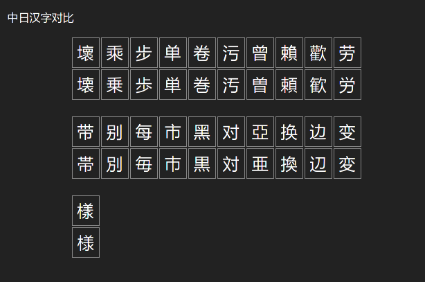

# note

This is a blog site of student notes, including subjects of:

* maths
* computer science
* physics
* language
* music

This site uses KaTeX/MathML for math rendering. MathML is faster and is
available for Firefox and Safari, and KaTeX is good to go for all other
browsers that don't support MathML.

Please visit [github page for this repo](https://zmx0142857.github.io/note/) or [gitee page for this repo](https://zmx0142857.gitee.io/note/).

